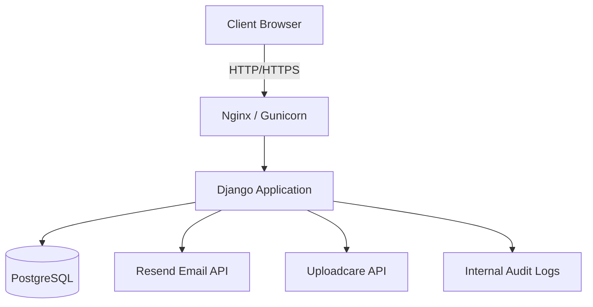

# System Architecture - Allianz Shield Plus

## 🏗 High-Level Overview

Allianz Shield Plus is a modern web application built on a decoupled architecture, using Django as a robust backend API and administrative hub, with a responsive frontend built on Tailwind CSS and Vanilla JavaScript.

## 💻 Technology Stack

| Layer | Technology | Rationale |
|-------|------------|-----------|
| **Backend** | Django 4.2 | Rapid development, built-in security, robust ORM. |
| **API** | DRF 3.14 | Standardized RESTful endpoints, easy serialization. |
| **Database** | PostgreSQL | Relational integrity, ACID compliance, Railway native. |
| **Styling** | Tailwind CSS 3.3 | Rapid UI development, consistent branding, mobile-first. |
| **Scripting** | Vanilla JS | Performance, zero-dependency, direct DOM manipulation. |
| **Hosting** | Railway | Seamless deployment, auto-scaling, integrated DB. |
| **Email** | Resend / SendGrid | Reliable delivery, easy API integration. |

## 🔄 Data Flow

1. **Submission:** User interacts with the 9-step form. Data is auto-saved to `localStorage` via the `state-manager.js`.
2. **Validation:** Client-side validation (`validation.js`) ensures data integrity before submission.
3. **API Call:** Form data is POSTed to `/api/applications/`.
4. **Backend Processing:**
   - Django validates the request using `ApplicationSerializer`.
   - Sensitive fields (ID Number) are encrypted using AES-256.
   - Application is saved to PostgreSQL.
   - An `AuditLog` entry is created for compliance.
5. **Notification:** An email confirmation is sent via the `email_service.py`.
6. **Admin Review:** Admins use the dashboard to filter, review, and update application statuses.

## 🔐 Security Architecture

- **PII Encryption:** Sensitive personal identifiable information is encrypted at rest using the `backend/utils/encryption.py` module.
- **Audit Logging:** Every modification to an application is recorded in the `AuditLog` model, including the actor, timestamp, and field changes.
- **CSRF & XSS:** Standard Django middleware is leveraged for protection against common web vulnerabilities.
- **Rate Limiting:** API endpoints are throttled to prevent abuse and brute-force attacks.

## 📊 Component Diagram

---

**Last Updated:** April 22, 2026
